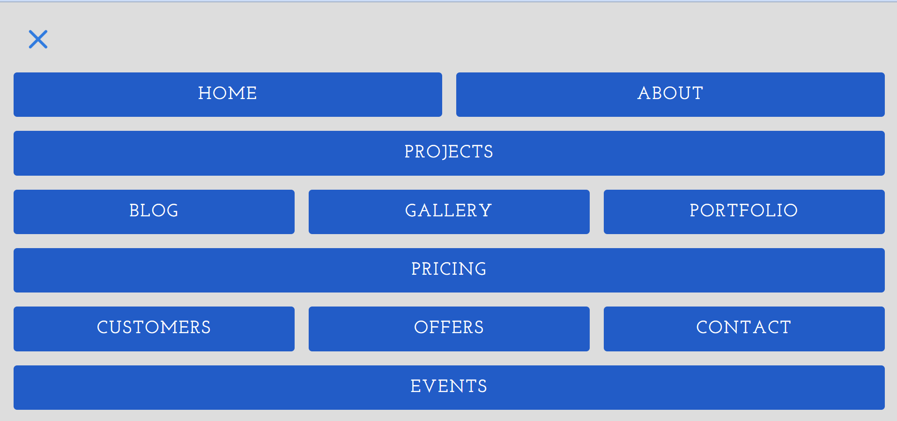

# CSS_Grid_Menu

## Description
A landing page example with an animated hamburger menu and a navigation menu built using CSS grid.
When the hamburger menu is clicked the landing page is hidden and the navigation menu will appear.
the hamburger menu transforms in an X shape.  The menu is greated using CSS grid and is fully responsive to different screen sizes. An example of the menu can be seen in the below screenshot.

## Demo
A demo of the project can be found here: https://tod619.github.io/CSS_Grid_Menu/
